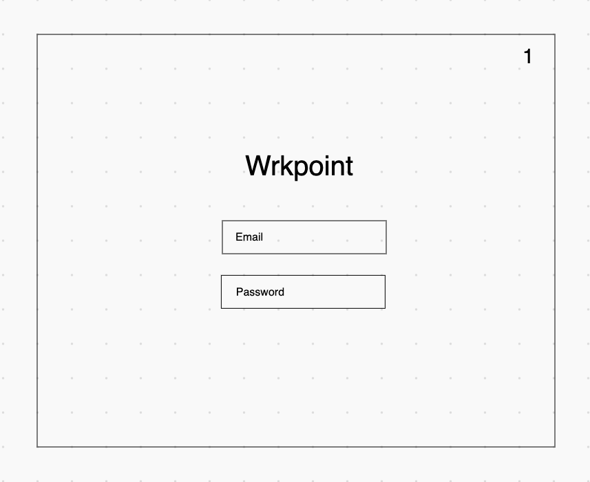
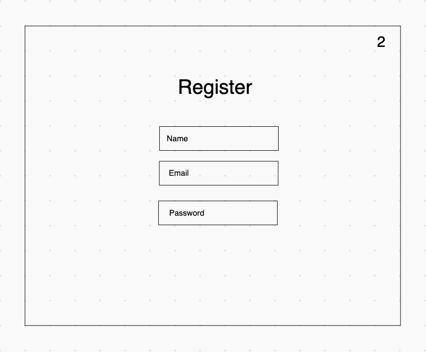
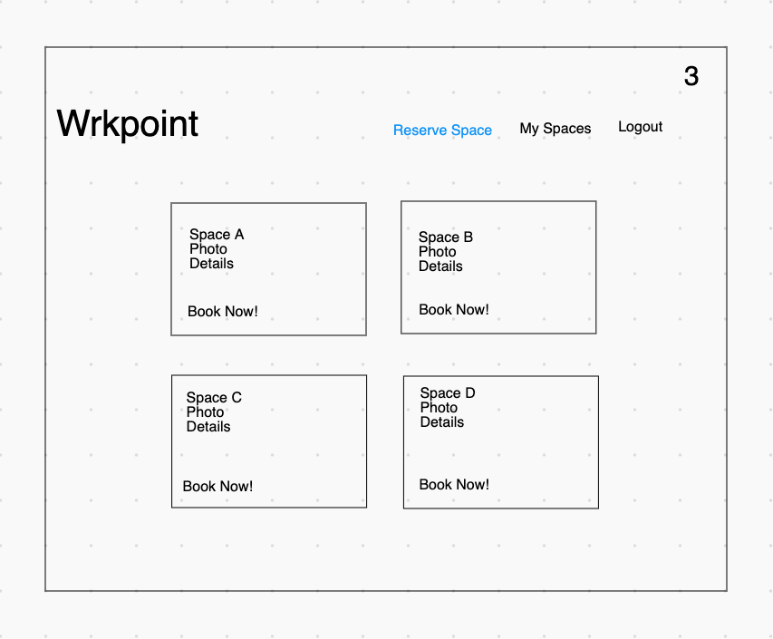
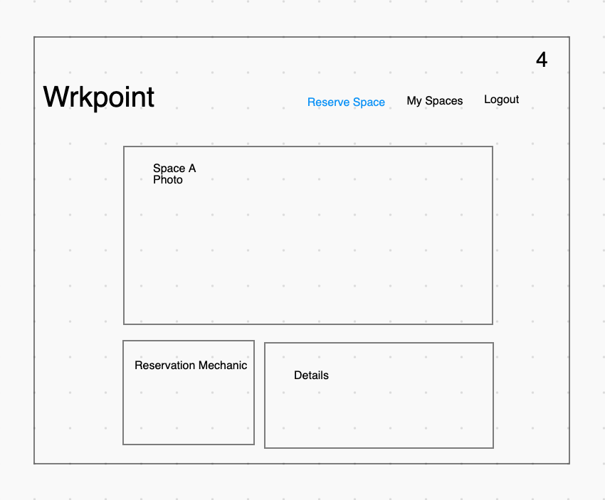
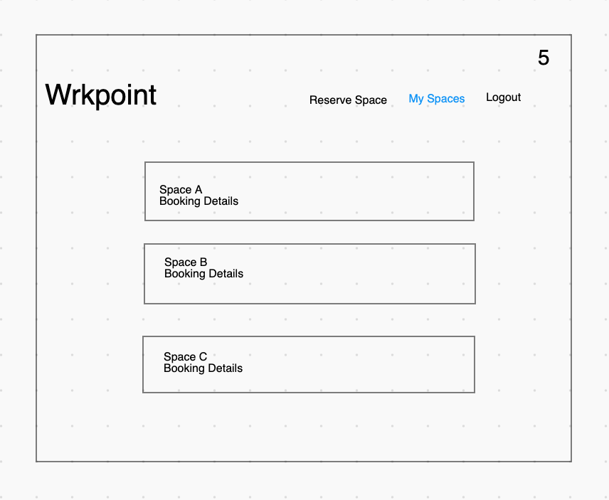
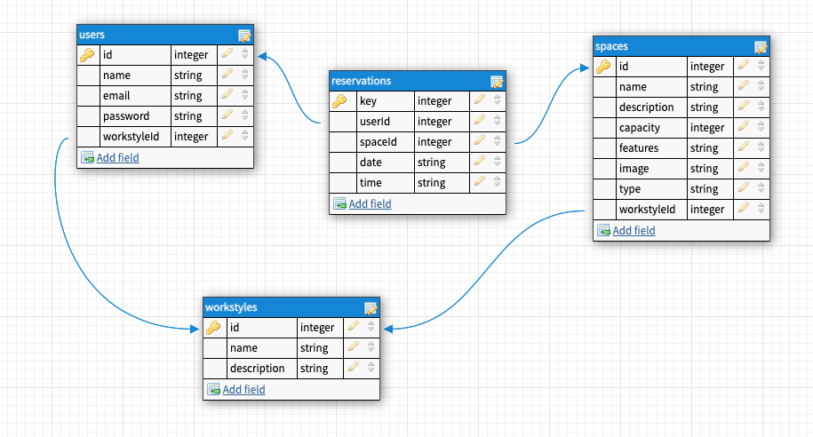

# Wrkpoint

## Overview
Wrkpoint is a full stack web application that enables users to browse and reserve available work spaces for the day. The application will leverage its own seeded set of work space data such as room names, seat capacities, and images.

Core features include user authentication, work space reservations, and the ability to filter available work spaces with search terms.

Stretch features include admin/utilization view and user workstyle assessment/recommendations.

## Wireframes
#### Homepage/Login

#### Register New User

#### View All Available Work Spaces

#### View Single Work Space

#### View My Work Space Reservations

## User Stories
1. When I load Wrkpoint for the first time, I am able to register or login.
2. When I register for the first time, I will be able to enter my name, email, and password.
3. When I login, I will need to enter my email and password.
4. When I finish logging in, I will see my dashboard with my current workspace reservations.
5. When I click on a reservation, I will see the work space details.
6. When I view all reservations, I will see all the workspaces that are available.
7. When I click reserve work space, I will be able to reserve the space for the scheduled time.

## Entity Relationship Diagram

## Routes Inventory

| Verb | Path | Route Summary |
| --- | --- | --- |
| `GET` | `/users/verify` | Verify user |
| `POST` | `/users` | Register new user |
| `POST` | `/users/login` | Login existing user |
| `GET` | `/spaces/all` | Fetch all work spaces |
| `POST` | `/spaces/reserve` | Reserve work space |
| `PUT` | `/spaces/:id` | Update space reservation |
| `DELETE` | `/spaces/:id` | Remove space reservation |

## MVP Checklist
1. [ ] Build frontend with minimal HTML & CSS
2. [ ] Build backend with routes, controllers, and Postgres database
3. [ ] Build user authentication
4. [ ] Build work space listings
5. [ ] Build work space reservation system
6. [ ] Build user dashboard for user's reservations
7. [ ] Build filter for reservation listing

## Stretch Goals
1. [ ] App branding
2. [ ] Deep CSS styling
3. [ ] Mobile/responsive design
4. [ ] User workstyle assessment
5. [ ] User workstyle work space recommendations
6. [ ] Admin dashboard for space utilization